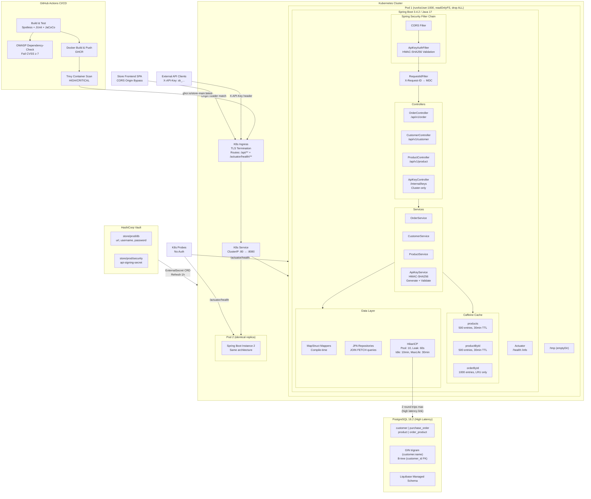
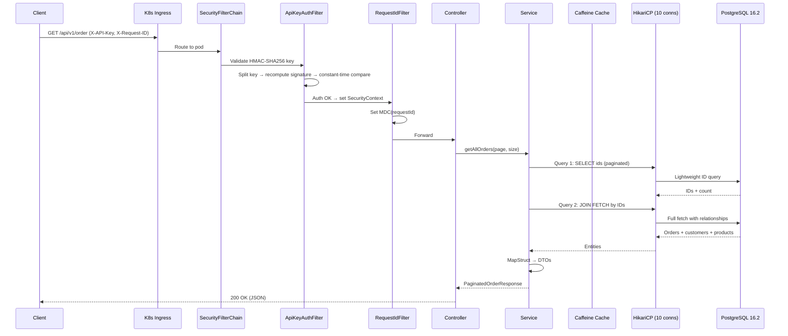
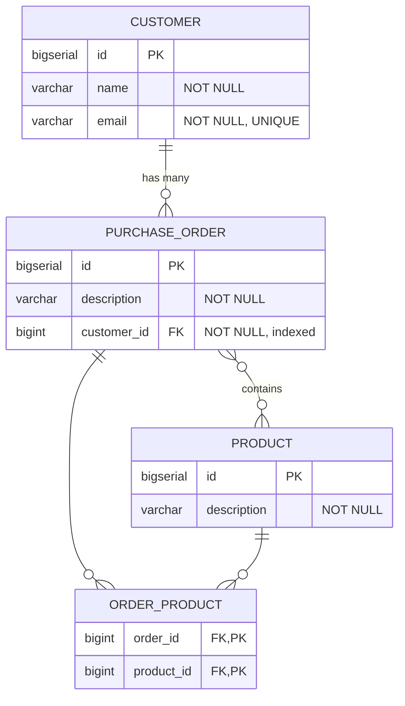
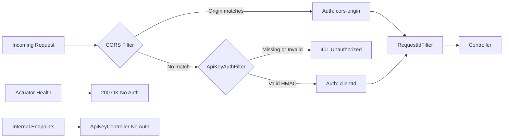
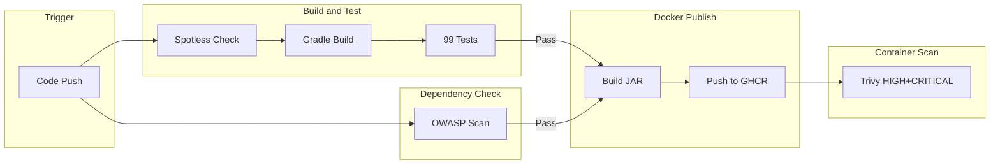
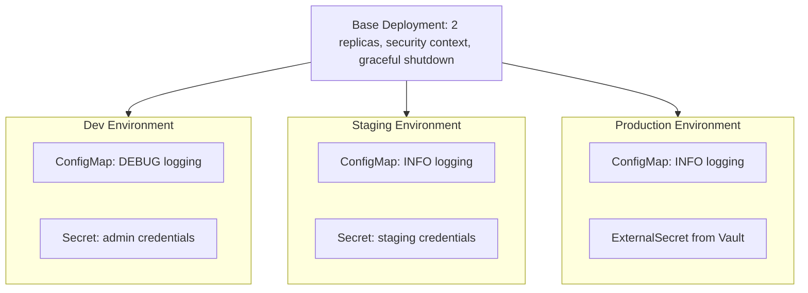

# Store Application — Architecture Diagrams

## System Overview

---

## Request Flow (Sequence Diagram)

---

## Data Model (ER Diagram)

---

## Security Filter Chain

---

## CI/CD Pipeline

---

## Deployment Environments

